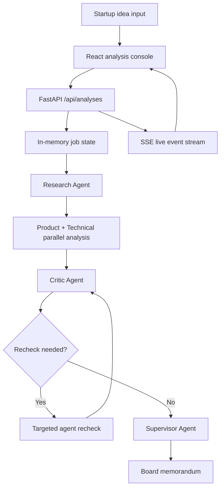

<div align="center">

[中文](./README.md)

<br>

[Project Logo]

# VentureMind AI 🧠

---

A multi-agent analysis workspace for evaluating startup ideas.

VentureMind AI turns market research, product reasoning, technical feasibility, red-team review, and final decision memos into one observable workflow. It is built for founders, product teams, and researchers who need to test an idea quickly, align judgment, and produce a structured board-style memo.


<br>

[Hero Demo Image: show the VentureMind AI board, live agent states, logs, and final memo preview here]

</div>

<br>

> Tip  
> If you only want to run the project as quickly as possible, start with [Quick Start](#quick-start-). When no model API key is configured, the backend automatically uses fallback outputs, so the local demo flow still works.

<br>

## Overview 🧭

VentureMind AI is a multi-agent platform for startup analysis. After the user enters an idea, the system performs market research, product demand analysis, technical and operational feasibility review, red-team critique, and a structured board memorandum.

It is not a one-shot chatbot. It is an observable, traceable, and reviewable workflow. The frontend shows each agent's live status, logs, result entry points, and final report, so users can see what the system is doing and why it reached a conclusion.

<br>

## Why this exists 💡

Early startup evaluation often breaks down in three places: scattered information, conclusions that cannot be traced, and optimistic assumptions that are not challenged. A one-off AI answer can be fast, but it rarely shows where the evidence came from, which step needs review, or whether different dimensions disagree.

VentureMind AI separates the work into specialized roles. Market, product, technical, and risk perspectives produce their own conclusions before the Supervisor agent synthesizes a final recommendation. The goal is not to replace human judgment, but to move a vague idea into a clearer, more discussable decision state.

<br>

## Key Features ✨

- **Multi-agent analysis**: Research, Product, Technical, Critic, and Supervisor agents each own a specific part of the decision.
- **Live analysis console**: SSE streams job status, agent progress, and runtime logs into the frontend.
- **Red-team review loop**: The Critic agent checks evidence gaps and overly optimistic assumptions, then triggers targeted rechecks when needed.
- **Clickable search citations**: The Research agent can use Tavily, Brave Search, SerpAPI, or Exa and render source URLs as verifiable references.
- **Structured board memorandum**: The Supervisor agent combines scores, key reasons, consensus, and Markdown into a readable final report.
- **OpenAI-compatible model interface**: Environment variables can switch any Chat Completions-compatible model service; missing keys fall back to local demo outputs.

<br>

## Demo / Screenshots 📸

[Main Screenshot: show the input console, five-agent workflow, and floating live logs window]

This image should show the main analysis board: the startup idea input, the agent workflow, and the floating live logs panel.

[Final Report Screenshot: show the board memorandum, decision score panel, agent consensus, and live logs]

This image should show the final report page, including the board decision, reconciled scores, agent consensus, and memo body.

<br>

## How it works ⚙️

VentureMind AI first builds a factual base, then branches into product and technical analysis, runs a red-team review, and finally produces a decision memo.



Core flow:

1. The frontend submits a startup idea and the backend creates an analysis job.
2. The backend orchestrates agents with LangGraph; if LangGraph is unavailable, it uses the built-in sequential fallback flow.
3. Product and Technical agents run in parallel after Research.
4. The Critic agent decides whether risks or evidence gaps require a recheck.
5. The Supervisor agent synthesizes all outputs into the final report.
6. The frontend subscribes through `EventSource` and refreshes the UI as events arrive.

<br>

## Quick Start 🚀

### Requirements

| Tool | Version |
| --- | --- |
| Node.js | 18+ |
| npm | 9+ |
| Python | 3.11+ |

### 1. Install frontend dependencies

```bash
npm install
```

### 2. Install backend dependencies

Windows PowerShell:

```powershell
cd backend
python -m venv .venv
.\.venv\Scripts\activate
pip install -e ".[test]"
```

macOS / Linux:

```bash
cd backend
python -m venv .venv
source .venv/bin/activate
pip install -e ".[test]"
```

### 3. Configure environment variables

```bash
cp backend/.env.example backend/.env
```

Windows PowerShell:

```powershell
Copy-Item backend\.env.example backend\.env
```

`OPENAI_API_KEY` can be empty. When it is empty, the system uses fallback outputs for local demos.

### 4. Start the backend

```bash
cd backend
uvicorn app.main:app --reload --port 8000
```

Backend URL: `http://localhost:8000`  
API docs: `http://localhost:8000/docs`

### 5. Start the frontend

```bash
npm run dev
```

Frontend URL: `http://localhost:3000`

<br>

## Usage 🛠️

### Analyze a startup idea

1. Open `http://localhost:3000`.
2. Enter a startup idea, for example:

```text
Open a low-alcohol beverage bar in Chinese highway service areas for non-driving passengers during short stops
```

3. Click `Start Analysis`.
4. Watch agent states, live logs, and the final report entry point.
5. When the analysis completes, open the `Board Memorandum` page.

### Create a job through the API

```http
POST /api/analyses
```

```json
{
  "idea": "AI-powered personal finance coach for college students",
  "context": "Optional extra context",
  "constraints": {}
}
```

### Subscribe to live events

```http
GET /api/analyses/{analysis_id}/stream
```

Event types include `snapshot`, `status`, `agent`, `log`, `result`, and `report`.

<br>

## Configuration 🧰

| Variable | Purpose | Default | Required |
| --- | --- | --- | --- |
| `OPENAI_API_KEY` | Model service API key; empty value enables fallback mode | Empty | No |
| `OPENAI_BASE_URL` | OpenAI-compatible API base URL | `https://api.deepseek.com` | No |
| `OPENAI_MODEL` | Model name | `deepseek-v4-flash` | No |
| `OPENAI_TIMEOUT_SECONDS` | Model request timeout | `60` | No |
| `MAX_REFLECTION_LOOPS` | Maximum Critic-triggered recheck loops | `1` | No |
| `CORS_ORIGINS` | Frontend origins allowed to access the backend | `http://localhost:3000,http://127.0.0.1:3000` | No |
| `SEARCH_PROVIDER` | Search provider: `none`, `tavily`, `brave`, `serpapi`, or `exa` | `none` | No |
| `SEARCH_API_KEY` | Search service API key | Empty | Required when search is enabled |
| `SEARCH_MAX_RESULTS` | Maximum search results per query | `5` | No |
| `VITE_API_BASE_URL` | Base URL used by the frontend to reach the backend | `http://localhost:8000` | No |

<br>

## Architecture 🧩

| Module | Location | Description |
| --- | --- | --- |
| Frontend console | `src/pages/Home.tsx` | Accepts ideas, shows the agent workflow, and subscribes to live events |
| Agent detail pages | `src/pages/*Agent.tsx` | Display each agent's summary, scores, evidence, and risks |
| Final report page | `src/pages/FinalReport.tsx` | Shows the board memo, scores, and agent consensus |
| API routes | `backend/app/api/routes.py` | Creates jobs, reads snapshots, and serves the SSE stream |
| Workflow orchestration | `backend/app/core/orchestrator.py` | Coordinates Research, Product, Technical, Critic, and Supervisor |
| Job state | `backend/app/services/store.py` | Stores in-memory jobs, updates state, and publishes events |
| Search service | `backend/app/services/search.py` | Wraps Tavily, Brave, SerpAPI, and Exa |
| Model service | `backend/app/services/llm.py` | Calls OpenAI-compatible APIs and provides fallback outputs |

Project structure:

```text
venturemind-ai/
├── src/
│   ├── components/
│   ├── lib/
│   ├── pages/
│   ├── App.tsx
│   └── main.tsx
├── backend/
│   ├── app/
│   │   ├── agents/
│   │   ├── api/
│   │   ├── core/
│   │   ├── prompts/
│   │   ├── services/
│   │   └── schemas.py
│   ├── tests/
│   └── pyproject.toml
├── package.json
├── vite.config.ts
└── README.md
```

<br>

## Roadmap 🗺️

- Persist analysis jobs and historical reports.
- Add user accounts, project history, and team collaboration views.
- Export board memos as PDF, DOCX, or Markdown.
- Support Pitch Deck, industry report, or interview-material uploads.
- Add RAG over uploaded documents.
- Score citation quality and source reliability.
- Add Docker Compose for one-command startup.
- Add CI for type checks, backend tests, and frontend builds.

<br>

## FAQ ❓

### Can it run without `OPENAI_API_KEY`?

Yes. The backend enters fallback mode and returns structured demo results, which is useful for previewing the local workflow.

### Is search enabled by default?

No. When `SEARCH_PROVIDER=none`, the backend does not call external search services. To enable search, configure a provider and its `SEARCH_API_KEY`.

### Are analysis jobs persisted?

No. The current implementation uses in-memory job state, which is suitable for demos and development. Production use should add a database or durable queue.

### Can the final memo be used directly for investment or legal decisions?

Not by itself. It is decision-support material and still requires human review, fact checking, and professional judgment.

<br>

## Contributing 🤝

Issues and pull requests are welcome. A minimal contribution flow:

1. Fork the repository and create a new branch.
2. Focus on one clear change: feature, bug fix, documentation, or test.
3. Run the frontend build and backend tests locally.
4. Open a PR and describe the purpose, verification, and potential impact.

If you change agent prompts, also describe the expected output changes so the structured fields remain stable.

<br>

## License 📄

Current license: [License]

If this repository is prepared for public distribution, add an explicit open-source license file such as MIT, Apache-2.0, or another license that fits the project goal.

<br>

## Contact 📬

Maintainer: [Maintainer]

Repository: [https://github.com/dakjdakd/VentureMind-AI](https://github.com/dakjdakd/VentureMind-AI)

