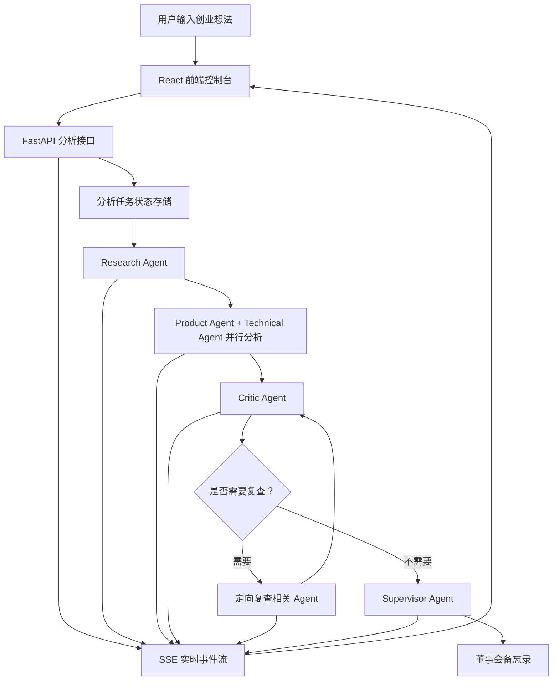

# VentureMind AI

> 一个多智能体创业分析平台：输入一个创业想法，系统会自动完成市场研究、产品需求分析、技术可行性评估、红队质疑，并生成一份结构化的董事会备忘录。


VentureMind AI 不是一个普通的 AI 对话框，而是一个完整的多智能体决策工作台。它把一个创业想法拆解给多个专业 Agent：市场研究、产品需求、技术可行性、风险审查和最终汇总分别由不同角色完成。整个过程会在前端实时可视化，用户可以看到每个 Agent 的运行状态、日志、分析结论、风险提示和最终报告。

项目的目标是让 AI 创业分析从“单次回答”变成“可观察、可追踪、可质疑、可复查”的工作流。

---

## 目录

- [项目亮点](#项目亮点)
- [运行效果](#运行效果)
- [系统架构](#系统架构)
- [智能体设计](#智能体设计)
- [技术栈](#技术栈)
- [目录结构](#目录结构)
- [快速开始](#快速开始)
- [环境变量](#环境变量)
- [接口说明](#接口说明)
- [可用脚本](#可用脚本)
- [实现细节](#实现细节)
- [后续规划](#后续规划)
- [当前限制](#当前限制)

---

## 项目亮点

### 多智能体协作分析

系统将创业分析拆分为多个专业角色，而不是让一个模型一次性输出所有内容。每个 Agent 都有独立职责、独立提示词、独立结构化输出和独立详情页。

| 智能体 | 职责 | 主要输出 |
| --- | --- | --- |
| Research Agent | 市场研究与外部信息检索 | 市场规模、增长趋势、竞品、替代品、证据质量 |
| Product Agent | 用户需求与产品判断 | 用户画像、使用场景、需求强度、购买触发点 |
| Technical Agent | 技术与运营可行性 | 实现难度、成本结构、基础设施、合规与运营风险 |
| Critic Agent | 红队审查 | 反例、风险、证据缺口、是否需要复查 |
| Supervisor Agent | 汇总决策 | 最终建议、关键理由、董事会备忘录 |

这种拆分方式让系统输出更接近真实团队的协作分析，而不是一段不可追踪的模型回答。

### 实时 Agent 控制台

首页是一个 AI Venture Board 控制台。分析开始后，前端会实时展示：

- 当前分析阶段
- 每个 Agent 的运行状态
- 后端实时日志
- 已完成 Agent 的详情入口
- 最终报告入口

用户不需要等待一个黑盒结果，可以清楚看到系统正在执行哪些步骤。

### 红队复查机制

Critic Agent 不只是列出风险，还可以触发复查流程。当它发现 Research、Product 或 Technical 的结论存在关键证据缺口时，后端会根据 `recheck_targets` 重新调用对应 Agent，再由 Critic 进行二次审查。

这让工作流具备基础的自我审查能力：先分析，再质疑，必要时重新分析，最后再生成结论。

### 可点击的搜索引证

Research Agent 支持接入外部搜索服务。搜索结果会进入 Agent 的上下文，用于生成更有依据的市场证据。

目前支持的搜索供应商：

- Tavily
- Brave Search
- SerpAPI
- Exa

如果某条证据带有来源 URL，前端会将它渲染为可点击引用。用户可以直接跳转到原始新闻、文章或网页，验证这条信息的来源。

### 干净的董事会备忘录展示

Supervisor Agent 会生成完整的董事会备忘录。模型输出通常会包含 Markdown 标记，例如 `**重点**`、`- 列表项` 或 `[链接](url)`。前端会在显示层进行清洗和格式化，避免把原始 Markdown 符号直接暴露给用户。

最终页面呈现的是可阅读的报告，而不是模型输出草稿。

### 兼容 OpenAI 风格模型接口

后端通过 OpenAI-compatible 接口调用模型，支持通过环境变量切换模型服务：

- `OPENAI_API_KEY`
- `OPENAI_BASE_URL`
- `OPENAI_MODEL`

只要服务兼容 Chat Completions API，就可以接入不同模型供应商。没有配置 API Key 时，系统会自动使用 fallback 输出，方便本地演示和开发调试。

---

## 运行效果

典型使用流程：

1. 用户输入一个创业想法。
2. 系统创建分析任务。
3. Research Agent 开始市场和外部信息分析。
4. Product Agent 与 Technical Agent 并行运行。
5. Critic Agent 对前面结果进行风险审查。
6. 如果存在关键证据缺口，系统进入复查流程。
7. Supervisor Agent 汇总所有结果。
8. 前端展示最终董事会备忘录。

示例输入：

```text
在中国高速服务区开设低度酒精饮品吧，为非驾驶乘客提供短暂停留消费体验
```

系统会围绕以下问题展开分析：

- 市场空间是否足够大
- 用户需求是否真实存在
- 消费场景是否成立
- 技术和运营是否可行
- 法规和安全风险是否可控
- 应该继续推进、调整方向，还是放弃

---

## 系统架构



系统分为三层：

| 层级 | 说明 |
| --- | --- |
| 前端展示层 | 负责用户输入、Agent 状态展示、实时日志、详情页和最终报告 |
| 后端接口层 | 负责创建任务、查询快照、推送实时事件、管理任务状态 |
| Agent 工作流层 | 负责多智能体编排、并行分析、红队复查和报告生成 |

---

## 智能体设计

### Research Agent

Research Agent 负责建立市场事实基础。

它会分析：

- 市场规模
- 增长趋势
- 竞争强度
- 替代品
- 定价和商业化信号
- 外部搜索证据
- 证据质量

证据项支持纯文本和带来源的对象两种格式：

```json
[
  "普通文本证据",
  {
    "text": "基于搜索结果的市场信号",
    "url": "https://example.com/source",
    "sourceTitle": "原始来源标题",
    "source": "tavily"
  }
]
```

前端会自动识别 URL，并将证据渲染为可点击来源。

### Product Agent

Product Agent 负责判断用户需求是否真实成立。

它会分析：

- 用户画像
- 使用场景
- 痛点强度
- 购买触发点
- 替代方案
- 留存风险
- 付费意愿

这个 Agent 用来避免项目只停留在“听起来有趣”，而没有真实用户动机。

### Technical Agent

Technical Agent 负责判断项目能否落地。

它会分析：

- 技术实现难度
- MVP 范围
- 运维复杂度
- 成本结构
- 基础设施需求
- 合规风险
- 可靠性问题

### Critic Agent

Critic Agent 是系统中的红队角色。

它会审查：

- 是否存在过度乐观假设
- 是否缺少关键证据
- 市场规模是否被夸大
- 用户需求是否只是推测
- 成本和法规风险是否被低估
- 是否需要触发复查

### Supervisor Agent

Supervisor Agent 负责汇总所有 Agent 的结论并生成最终报告。

它输出：

- `verdict`
- `verdictLabel`
- `summary`
- `scores`
- `keyReasons`
- `agentConsensus`
- `markdown`

前端会把 `markdown` 拆分为多个报告章节，并转换成干净的页面内容。

---

## 技术栈

### 前端

| 技术 | 用途 |
| --- | --- |
| React 19 | 页面和组件渲染 |
| TypeScript | 类型约束 |
| Vite | 开发服务器和构建工具 |
| React Router | 页面路由 |
| Tailwind CSS | 样式系统 |
| motion/react | 页面动效 |
| lucide-react | 图标 |
| EventSource | 订阅 SSE 实时事件 |

### 后端

| 技术 | 用途 |
| --- | --- |
| FastAPI | 后端接口服务 |
| Pydantic v2 | 数据模型和结构校验 |
| Pydantic Settings | 环境变量配置 |
| LangGraph | Agent 工作流编排 |
| OpenAI SDK | 调用兼容 OpenAI 的模型服务 |
| httpx | 调用搜索服务 |
| Uvicorn | ASGI 服务 |
| Server-Sent Events | 实时事件推送 |

---

## 目录结构

```text
venturemind-ai/
├── src/
│   ├── components/
│   │   ├── AgentCard.tsx
│   │   └── LiveLogs.tsx
│   ├── lib/
│   │   ├── api.ts
│   │   └── utils.ts
│   ├── pages/
│   │   ├── Home.tsx
│   │   ├── AgentDetail.tsx
│   │   ├── ResearchAgent.tsx
│   │   ├── ProductAgent.tsx
│   │   ├── TechnicalAgent.tsx
│   │   ├── CriticAgent.tsx
│   │   └── FinalReport.tsx
│   ├── App.tsx
│   └── main.tsx
│
├── backend/
│   ├── app/
│   │   ├── agents/
│   │   │   ├── research.py
│   │   │   ├── product.py
│   │   │   ├── technical.py
│   │   │   ├── critic.py
│   │   │   ├── supervisor.py
│   │   │   └── common.py
│   │   ├── api/
│   │   │   └── routes.py
│   │   ├── core/
│   │   │   ├── config.py
│   │   │   ├── orchestrator.py
│   │   │   └── state.py
│   │   ├── prompts/
│   │   ├── services/
│   │   │   ├── llm.py
│   │   │   ├── search.py
│   │   │   ├── store.py
│   │   │   └── stream.py
│   │   ├── schemas.py
│   │   └── main.py
│   └── pyproject.toml
│
├── package.json
├── vite.config.ts
├── tsconfig.json
└── README.md
```

---

## 快速开始

### 环境要求

- Node.js 18+
- npm 9+
- Python 3.11+

### 1. 获取项目代码

```bash
git clone <repository-url>
cd venturemind-ai
```

如果已经下载到本地，直接进入项目根目录即可。

### 2. 安装前端依赖

```bash
npm install
```

### 3. 安装后端依赖

Windows PowerShell：

```powershell
cd backend
python -m venv .venv
.\.venv\Scripts\activate
pip install -e ".[test]"
```

macOS / Linux：

```bash
cd backend
python -m venv .venv
source .venv/bin/activate
pip install -e ".[test]"
```

### 4. 配置后端环境变量

创建 `backend/.env`：

```bash
cp backend/.env.example backend/.env
```

Windows PowerShell：

```powershell
Copy-Item backend\.env.example backend\.env
```

示例配置：

```text
OPENAI_API_KEY=your_api_key
OPENAI_BASE_URL=https://api.deepseek.com
OPENAI_MODEL=deepseek-v4-flash
OPENAI_TIMEOUT_SECONDS=60
MAX_REFLECTION_LOOPS=1
CORS_ORIGINS=http://localhost:3000,http://127.0.0.1:3000
SEARCH_PROVIDER=none
SEARCH_API_KEY=
SEARCH_MAX_RESULTS=5
```

`OPENAI_API_KEY` 可以留空。留空时后端会使用 fallback 输出，仍然可以跑通完整流程。

### 5. 启动后端

在 `backend/` 目录中运行：

```bash
uvicorn app.main:app --reload --port 8000
```

后端地址：

```text
http://localhost:8000
```

接口文档：

```text
http://localhost:8000/docs
```

### 6. 启动前端

在项目根目录运行：

```bash
npm run dev
```

前端地址：

```text
http://localhost:3000
```

---

## 环境变量

| 变量名 | 说明 | 默认值 |
| --- | --- | --- |
| `OPENAI_API_KEY` | 模型服务 API Key，留空时使用 fallback 模式 | 空 |
| `OPENAI_BASE_URL` | 兼容 OpenAI 的 API 地址 | `https://api.deepseek.com` |
| `OPENAI_MODEL` | 模型名称 | `deepseek-v4-flash` |
| `OPENAI_TIMEOUT_SECONDS` | 模型请求超时时间 | `60` |
| `MAX_REFLECTION_LOOPS` | Critic 触发复查的最大轮数 | `1` |
| `CORS_ORIGINS` | 允许访问后端的前端地址 | `http://localhost:3000,http://127.0.0.1:3000` |
| `SEARCH_PROVIDER` | 搜索服务供应商，可选 `none`、`tavily`、`brave`、`serpapi`、`exa` | `none` |
| `SEARCH_API_KEY` | 搜索服务 API Key | 空 |
| `SEARCH_MAX_RESULTS` | 每个搜索 query 的最大结果数 | `5` |
| `VITE_API_BASE_URL` | 前端请求后端的基础地址 | `http://localhost:8000` |

---

## 接口说明

### 创建分析任务

```http
POST /api/analyses
```

请求示例：

```json
{
  "idea": "AI-powered personal finance coach for college students",
  "context": "Optional extra context",
  "constraints": {}
}
```

响应示例：

```json
{
  "analysisId": "abc123",
  "status": "queued",
  "streamUrl": "/api/analyses/abc123/stream"
}
```

### 获取分析快照

```http
GET /api/analyses/{analysis_id}
```

返回当前任务状态、Agent 状态、日志、中间结果、Critic 结果和最终报告。

### 订阅实时事件

```http
GET /api/analyses/{analysis_id}/stream
```

事件类型：

| 事件 | 说明 |
| --- | --- |
| `snapshot` | 初始任务快照 |
| `status` | 工作流状态更新 |
| `agent` | 单个 Agent 状态更新 |
| `log` | 实时日志 |
| `result` | Agent 结果更新 |
| `report` | 最终报告更新 |

---

## 可用脚本

### 前端

```bash
npm run dev
```

启动 Vite 开发服务器。

```bash
npm run build
```

构建生产版本。

```bash
npm run preview
```

预览生产构建。

```bash
npm run lint
```

运行 TypeScript 类型检查。

### 后端

```bash
uvicorn app.main:app --reload --port 8000
```

启动 FastAPI 开发服务器。

```bash
python -m compileall backend/app
```

检查 Python 文件语法。

---

## 实现细节

### 结构化模型输出

后端要求模型返回 JSON，并将结果规范化为前端可以稳定消费的数据结构。这样可以避免直接解析自然语言带来的不确定性。

相关文件：

```text
backend/app/services/llm.py
backend/app/agents/common.py
backend/app/schemas.py
```

### 工作流编排

核心流程为：

```text
research -> product_technical -> critic -> recheck? -> supervisor
```

Product Agent 和 Technical Agent 会并行运行。Critic Agent 可以根据结果质量决定是否进入复查节点。

相关文件：

```text
backend/app/core/orchestrator.py
```

### 实时事件流

后端通过 Server-Sent Events 推送任务快照、状态更新、日志、Agent 结果和最终报告。前端使用 `EventSource` 订阅这些事件，实现页面实时刷新。

相关文件：

```text
backend/app/api/routes.py
backend/app/services/stream.py
src/lib/api.ts
```

### 搜索引证

搜索服务统一封装在 `WebSearch` 中。Research Agent 可以读取搜索结果，并将来源 URL 写入证据项。前端会把带 URL 的证据渲染成可点击链接。

相关文件：

```text
backend/app/services/search.py
backend/app/agents/research.py
src/pages/AgentDetail.tsx
```

### 报告展示清洗

最终报告页面会对常见 Markdown 标记进行清洗和格式化，避免用户看到模型原始格式。

相关文件：

```text
src/pages/FinalReport.tsx
```

---

## 后续规划

- 持久化存储分析任务和历史报告
- 增加用户账户和历史项目列表
- 支持导出 PDF 或 DOCX 格式的董事会备忘录
- 增加 Pitch Deck 或行业报告上传能力
- 基于上传资料做 RAG 检索增强
- 增加引用质量评分和来源可信度排序
- 增加 Agent 输出质量评测
- 增加 Docker Compose 一键启动
- 增加 CI 类型检查和构建流程

---

## 当前限制

- 当前任务存储更适合本地演示，生产环境需要接入数据库。
- 搜索效果依赖所配置的搜索供应商和 API Key。
- 分析质量会受模型能力、提示词和外部资料质量影响。
- 当前系统适合作为决策辅助工具，不应替代正式的法律、财务或投资建议。
- 最终董事会备忘录仍需要人工复核后再用于真实业务决策。

---

## 项目总结

VentureMind AI 展示的是一个完整 AI 应用的工程链路：从前端控制台、实时日志、Agent 详情页，到后端工作流编排、模型调用、搜索引证、红队复查和最终报告生成。

它的核心价值不是“让 AI 回答一个问题”，而是把一个创业想法放进一个可观察的多智能体分析流程中，让结论有来源、有质疑、有复查，也有清晰的最终呈现。
