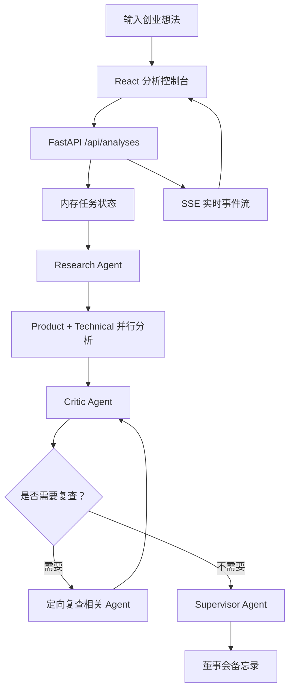

<div align="center">

[English](./README.en.md)

<br>

[Project Logo]

# VentureMind AI 🧠

---

一个面向创业想法评估的多智能体分析工作台。

VentureMind AI 将市场研究、产品判断、技术可行性、红队质疑和最终决策报告拆成一条可观察的工作流。它适合希望快速检验创业方向、对齐团队判断、沉淀结构化投资备忘录的产品团队、创始人和研究者。


<br>

[Hero Demo Image: show the VentureMind AI board, live agent states, logs, and final memo preview here]

</div>

<br>

> Tip  
> 如果你只想最快跑起来，请直接查看 [快速开始](#快速开始-)。未配置模型 API Key 时，后端会自动使用 fallback 输出，仍可完成本地演示流程。

<br>

## 项目概览 🧭

VentureMind AI 是一个多智能体创业分析平台。用户输入一个创业想法后，系统会依次完成市场研究、产品需求判断、技术和运营可行性评估、红队质疑，并生成结构化的董事会备忘录。

它不是一个单轮聊天框，而是一套可观察、可追踪、可复查的分析工作流。前端会实时展示每个 Agent 的运行状态、日志、结论入口和最终报告，让用户知道系统正在做什么、为什么得出这个判断。

<br>

## 为什么做这个 💡

创业想法的早期判断经常卡在三个问题上：信息分散、结论不可追踪、乐观假设缺少质疑。传统的一次性 AI 回答速度很快，但很难说明证据来自哪里、哪一步需要复查、不同维度之间是否互相冲突。

VentureMind AI 将分析拆成多个专业角色，让市场、产品、技术和风险各自形成独立结论，再由 Supervisor 汇总为最终建议。它的重点不是替代人的判断，而是把模糊想法推进到一个更清晰、更可讨论的决策状态。

<br>

## 核心功能 ✨

- **多智能体协作分析**：Research、Product、Technical、Critic 和 Supervisor 分别承担不同职责，避免单一模型一次性输出所有判断。
- **实时分析控制台**：通过 SSE 推送任务状态、Agent 进度和运行日志，前端可以实时展示工作流进展。
- **红队复查机制**：Critic Agent 会检查证据缺口和过度乐观假设，必要时触发定向复查。
- **可点击搜索引证**：Research Agent 可接入 Tavily、Brave Search、SerpAPI 或 Exa，将来源 URL 渲染为可验证引用。
- **结构化董事会备忘录**：Supervisor Agent 会整合分数、关键理由、共识和 Markdown 报告，前端再清洗为可读页面。
- **OpenAI-compatible 模型接口**：通过环境变量切换兼容 Chat Completions API 的模型服务；未配置 Key 时自动进入 fallback 模式。

<br>

## 效果展示 📸

[Main Screenshot: show the input console, five-agent workflow, and floating live logs window]

上图建议展示首页的完整分析工作台：顶部输入创业想法，中间是 Agent 工作流，右下角是实时日志窗口。

[Final Report Screenshot: show the board memorandum, decision score panel, agent consensus, and live logs]

最终报告页建议展示董事会结论、分数调和、Agent 共识和正文备忘录，让读者快速理解输出形态。

<br>

## 工作原理 ⚙️

VentureMind AI 的核心流程是先建立事实基础，再分支分析，随后进行红队审查，最后生成决策备忘录。



关键链路：

1. 前端提交创业想法，后端创建分析任务。
2. 后端用 LangGraph 编排 Agent；如果 LangGraph 不可用，则使用内置顺序流程。
3. Product Agent 和 Technical Agent 在 Research 之后并行运行。
4. Critic Agent 根据风险和证据缺口决定是否触发复查。
5. Supervisor Agent 汇总所有结果，生成最终报告。
6. 前端通过 `EventSource` 订阅实时事件并刷新页面状态。

<br>

## 快速开始 🚀

### 环境要求

| 工具 | 版本 |
| --- | --- |
| Node.js | 18+ |
| npm | 9+ |
| Python | 3.11+ |

### 1. 安装前端依赖

```bash
npm install
```

### 2. 安装后端依赖

Windows PowerShell:

```powershell
cd backend
python -m venv .venv
.\.venv\Scripts\activate
pip install -e ".[test]"
```

macOS / Linux:

```bash
cd backend
python -m venv .venv
source .venv/bin/activate
pip install -e ".[test]"
```

### 3. 配置环境变量

```bash
cp backend/.env.example backend/.env
```

Windows PowerShell:

```powershell
Copy-Item backend\.env.example backend\.env
```

`OPENAI_API_KEY` 可以留空。留空时系统会使用 fallback 输出，便于本地演示。

### 4. 启动后端

```bash
cd backend
uvicorn app.main:app --reload --port 8000
```

后端地址：`http://localhost:8000`  
接口文档：`http://localhost:8000/docs`

### 5. 启动前端

```bash
npm run dev
```

前端地址：`http://localhost:3000`

<br>

## 使用方式 🛠️

### 分析一个创业想法

1. 打开 `http://localhost:3000`。
2. 在输入框中填写创业想法，例如：

```text
在中国高速服务区开设低度酒精饮品吧，为非驾驶乘客提供短暂停留消费体验
```

3. 点击 `Start Analysis`。
4. 观察 Agent 状态、实时日志和最终报告入口。
5. 分析完成后进入 `Board Memorandum` 页面查看最终备忘录。

### 通过 API 创建任务

```http
POST /api/analyses
```

```json
{
  "idea": "AI-powered personal finance coach for college students",
  "context": "Optional extra context",
  "constraints": {}
}
```

### 订阅实时事件

```http
GET /api/analyses/{analysis_id}/stream
```

事件类型包括 `snapshot`、`status`、`agent`、`log`、`result` 和 `report`。

<br>

## 配置说明 🧰

| 变量名 | 作用 | 默认值 | 是否必填 |
| --- | --- | --- | --- |
| `OPENAI_API_KEY` | 模型服务 API Key，留空时使用 fallback 模式 | 空 | 否 |
| `OPENAI_BASE_URL` | 兼容 OpenAI 的 API 地址 | `https://api.deepseek.com` | 否 |
| `OPENAI_MODEL` | 模型名称 | `deepseek-v4-flash` | 否 |
| `OPENAI_TIMEOUT_SECONDS` | 模型请求超时时间 | `60` | 否 |
| `MAX_REFLECTION_LOOPS` | Critic 可触发复查的最大轮数 | `1` | 否 |
| `CORS_ORIGINS` | 允许访问后端的前端地址 | `http://localhost:3000,http://127.0.0.1:3000` | 否 |
| `SEARCH_PROVIDER` | 搜索供应商，可选 `none`、`tavily`、`brave`、`serpapi`、`exa` | `none` | 否 |
| `SEARCH_API_KEY` | 搜索服务 API Key | 空 | 启用搜索时必填 |
| `SEARCH_MAX_RESULTS` | 每个 query 的最大搜索结果数 | `5` | 否 |
| `VITE_API_BASE_URL` | 前端访问后端的基础地址 | `http://localhost:8000` | 否 |

<br>

## 技术架构 🧩

| 模块 | 位置 | 说明 |
| --- | --- | --- |
| 前端控制台 | `src/pages/Home.tsx` | 输入创业想法、展示 Agent 流程、订阅实时事件 |
| Agent 详情页 | `src/pages/*Agent.tsx` | 展示单个 Agent 的摘要、分数、证据和风险 |
| 最终报告页 | `src/pages/FinalReport.tsx` | 展示董事会备忘录、评分和 Agent 共识 |
| API 路由 | `backend/app/api/routes.py` | 创建任务、读取快照、提供 SSE 流 |
| 工作流编排 | `backend/app/core/orchestrator.py` | 编排 Research、Product、Technical、Critic、Supervisor |
| 状态存储 | `backend/app/services/store.py` | 内存任务存储、状态更新、事件发布 |
| 搜索服务 | `backend/app/services/search.py` | 封装 Tavily、Brave、SerpAPI、Exa |
| 模型服务 | `backend/app/services/llm.py` | 调用 OpenAI-compatible 接口并提供 fallback |

项目结构：

```text
venturemind-ai/
├── src/
│   ├── components/
│   ├── lib/
│   ├── pages/
│   ├── App.tsx
│   └── main.tsx
├── backend/
│   ├── app/
│   │   ├── agents/
│   │   ├── api/
│   │   ├── core/
│   │   ├── prompts/
│   │   ├── services/
│   │   └── schemas.py
│   ├── tests/
│   └── pyproject.toml
├── package.json
├── vite.config.ts
└── README.md
```

<br>

## 路线图 🗺️

- 持久化分析任务和历史报告。
- 增加用户账户、项目列表和团队协作视图。
- 支持导出 PDF、DOCX 或 Markdown 格式的董事会备忘录。
- 增加 Pitch Deck、行业报告或用户访谈资料上传能力。
- 基于上传资料做 RAG 检索增强。
- 增加引用质量评分和来源可信度排序。
- 增加 Docker Compose 一键启动。
- 增加 CI 类型检查、后端测试和前端构建流程。

<br>

## 常见问题 ❓

### 没有配置 `OPENAI_API_KEY` 能运行吗？

可以。后端会进入 fallback 模式，返回可演示的结构化结果，适合本地预览工作流。

### 搜索功能默认开启吗？

不开启。`SEARCH_PROVIDER=none` 时不会调用外部搜索。要启用搜索，需要设置供应商和对应的 `SEARCH_API_KEY`。

### 当前任务会持久化保存吗？

不会。当前实现使用内存任务存储，适合演示和开发；生产环境需要接入数据库或持久化队列。

### 最终报告能直接用于投资或法务决策吗？

不建议。它是决策辅助材料，仍需要人工复核、事实核验和专业判断。

<br>

## 贡献指南 🤝

欢迎通过 issue 和 pull request 参与改进。建议的最小流程：

1. Fork 仓库并创建新分支。
2. 聚焦一个清晰问题：功能、Bug、文档或测试。
3. 本地运行前端构建和后端测试。
4. 提交 PR，并说明改动目的、验证方式和潜在影响。

如果你要调整 Agent 提示词，请同时说明预期输出变化，避免影响结构化字段的稳定性。

<br>

## 许可证 📄

当前许可证：[License]

如果仓库准备公开分发，请补充明确的开源许可证文件，例如 MIT、Apache-2.0 或其他适合项目目标的协议。

<br>

## 维护者信息 📬

维护者：[Maintainer]

项目地址：[https://github.com/dakjdakd/VentureMind-AI](https://github.com/dakjdakd/VentureMind-AI)

